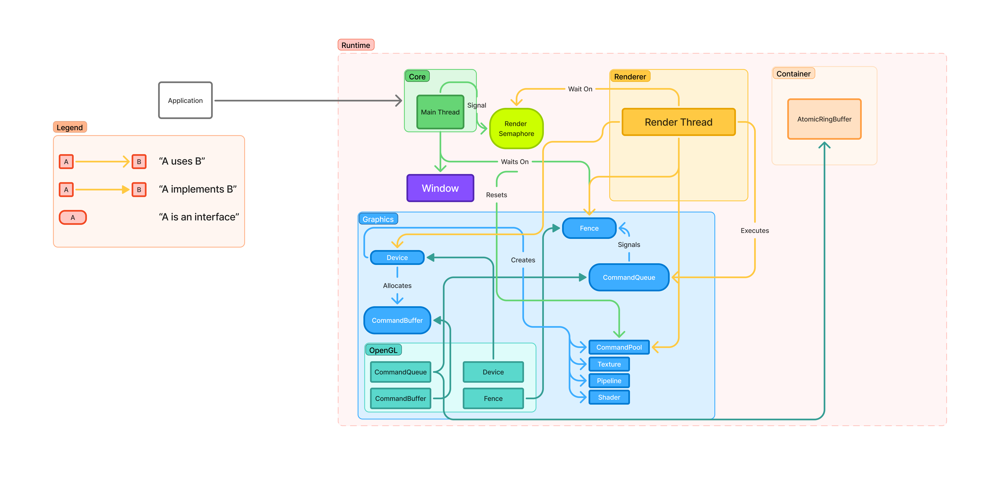

# Overview
Vane is composed of 2 parts:
- The runtime (actively developed in `runtime/`)
- The editor (TBD)

## The Runtime
It's the main component of the engine, the library collection which includes all of the game systems.

Those systems are:
- The Core module (`core`)
- The Window module (`core/window`)
- The Graphics module (`graphics`)
- The Renderer module (`renderer`)
- The Container Utility module (`container`)

The game loop flow is as follows:

